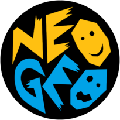

# GnGeoX : Another fork of the Gngeo NeoGeo emulator for linux (and maybe some other unix)

  

## GnGeoX:
GnGeoX is a fork of GnGeo that aims to modernize this great emulator yet giving it a new refresh. It is not the only one, i hope it will be for some interrest.
It has also an educationnal purpose : For me at first, to learn about Neo Geo software and hardware, but also, document all what is known to date about this piece of gaming history.
Thanks to all those fantastic people who contributed (directly or indirectly) by their work, dedication and generosity, at making this project possible. I tried to credit all ressources used in this project, do not hesitate to inform me if i forgot about someone.
I hope it will be useful, feel free to contribute and share.

## REQUIREMENT :
### SDL2
Simple DirectMedia Layer Version 2.0.0 or above.
### SDL-TTF
Version 2.0.0 or above.
### sqlite
Rom driver database and tile transparency data database, version 3.8.1.11 (included in this code distribution) or above.
### bstrlib :
Customized version of the library by Paul Hsieh (included in this code distribution).
### Qlib :
Customized version of the library by Seungyoung Kim (included in this code distribution).
### Zlog :
Customized version of the library by Hardy Simpson (included in this code distribution).
### generator68k :
Customized version of the library by James Ponder (included in this code distribution).
### Z80 :
Customized version of the library by Juergen Buchmueller (included in this code distribution).
### OpenGL:
For hardware accelerated blitters.
### code::blocks:
GnGeoX uses codeblocks workspace and project files to build binaries.

## INSTALLATION :

## CONFIGURATION :
All configuration can be done in *gngeox.ini*, please refer to this file for further details, as it is well commented.
Every option is also accessible on the command line.

## USAGE :
You can start a game with the folowing command:
>gngeo -f game or > gngeo --gamename game
where game is the name of the rom zip file, for example mslug for Metal Slug

Usage: gngeo [OPTION]... ROMSET

## LICENSE :
### GnGeo
Gngeo is build arround many different block with various license.
The original code is released under the GPLV2 with this special exception:

_As a special exception, You have
the permission to link the code of this program with
independent modules,regardless of the license terms of these
independent modules, and to copy and distribute the resulting
executable under terms of your choice, provided that you also
meet, for each linked independent module, the terms and conditions
of the license of that module. An independent module is a module
which is not derived from or based on Gngeo. If you modify
this library, you may extend this exception to your version of the
library, but you are not obligated to do so.  If you do not wish
to do so, delete this exception statement from your version._

### MAME
Gngeo could not exist without the Mame project, and some code come
directly from it (the ym2610 for example). As you may know, the Mame
license forbid commercial use, and as a consequence, commercial use
of gngeo (as a whole) is also forbided :

Redistribution and use of the MAME code or any derivative works are
permitted provided that the following conditions are met:

1 - Redistributions may not be sold, nor may they be used in a commercial product or activity.
2 - Redistributions that are modified from the original source
must include the complete source code, including the source
code for all components used by a binary built from the modified
sources. However, as a special exception, the source code distributed
need not include anything that is normally distributed (in either
source or binary form) with the major components (compiler, kernel,
and so on) of the operating system on which the executable runs,
unless that component itself accompanies the executable.
3 - Redistributions must reproduce the above copyright notice, this
list of conditions and the following disclaimer in the documentation
and/or other materials provided with the distribution.

This software is provided by the copyright holders and contributors "as is"
and any express or implied warranties, including, but not limited to, the
implied warranties of merchantability and fitness for a particular purpose
are disclaimed. in no event shall the copyright owner or contributors be
liable for any direct, indirect, incidental, special, exemplary, or
consequential damages (including, but not limited to, procurement of
substitute goods or services; loss of use, data, or profits; or business
interruption) however caused and on any theory of liability, whether in
contract, strict liability, or tort (including negligence or otherwise)
arising in any way out of the use of this software, even if advised of
the possibility of such damage.

### Z80
The original code is released under this licence :
- This source code is released as freeware for non-commercial purposes.
- You are free to use and redistribute this code in modified or unmodified form, provided you list me in the credits.
- If you modify this source code, you must add a notice to each modified source file that it has been changed.  If you're a nice person, you will clearly mark each change too.  :)
- If you wish to use this for commercial purposes, please contact me at pullmoll@t-online.de.
- The author of this copywritten work reserves the right to change the terms of its usage and license at any time, including retroactively.
- This entire notice must remain in the source code.

Disassembler is copyrighted by Marat Fayzullin 1995-2007.

### Generator (68 emulation layer)
The original code is released under the GPLV2.

### qLibc
The original code is released under this licence :
Copyright (c) 2010-2015 Seungyoung Kim.
All rights reserved.

Redistribution and use in source and binary forms, with or without
modification, are permitted provided that the following conditions are met:

1. Redistributions of source code must retain the above copyright notice,
   this list of conditions and the following disclaimer.
2. Redistributions in binary form must reproduce the above copyright notice,
   this list of conditions and the following disclaimer in the documentation
   and/or other materials provided with the distribution.

This software is provided by the copyright holders and contributors "as is"
and any express or implied warranties, including, but not limited to, the
implied warranties of merchantability and fitness for a particular purpose
are disclaimed. in no event shall the copyright owner or contributors be
liable for any direct, indirect, incidental, special, exemplary, or
consequential damages (including, but not limited to, procurement of
substitute goods or services; loss of use, data, or profits; or business
interruption) however caused and on any theory of liability, whether in
contract, strict liability, or tort (including negligence or otherwise)
arising in any way out of the use of this software, even if advised of the
possibility of such damage.

### bstrlib
The original source code is released under the GPLV2.

### Zlog
The original source code is released under the LGPL.

### Titillium Web TTF
Copyright (c) 2009-2011 by Accademia di Belle Arti di Urbino and students of MA course of Visual design. Some rights reserved.
This Font Software is licensed under the SIL Open Font License, Version 1.1. This license is available with a FAQ at: http://scripts.sil.org/OFL
